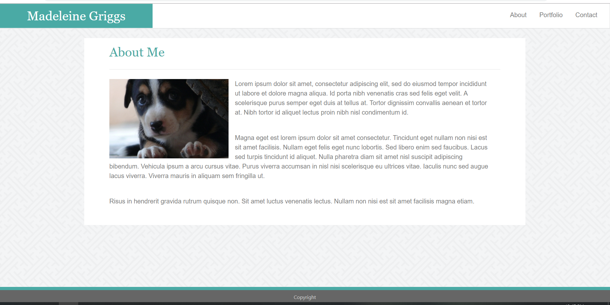

# Bootstrap-Portfolio
A simple web porfolio site, using bootstrap for styling and responsive behaviour.

## About this Project
this is a simple website designed to showcase a portfolio of work for web development. It was made as part of a project for the UofT coding bootcamp. The purpose of this project was to gain an understanding of how to use Bootstrap. The design is based on an earlier project, which you can find here:
[Basic Portfolio](https://typicu.github.io/Basic-Portfolio/)

the second part of this assignment, a responsive portfolio that does not use bootstrap, can be found here:
[Responsive Portfolio](https://typicu.github.io/Responsive-Portfolio/)

## Dependencies

[Bootstrap](https://getbootstrap.com/)
Please note this project relies on only the CSS portion of the BootstrapCDN. Popper.js and jQuery are not required.

## Information about the Theme

### Colors Used
-  `#4aaaa5 - Main Accent Color`
-  `#397f7b - Darker Accent Color`
-  `#777777 - Standard Font Color`
-  `#ffffff - Background of navbar and main content areas`
-  `#cccccc - Main header border color`
-  `#666666 - Footer background color`
-  `#dddddd - Main content border color`

### Fonts Used
- Font Family: 'Georgia', Times, Times New Roman, serif. Used for header text.
- Font Family: 'Arial', 'Helvetica Neue', Helvetica, sans-serif. Used for body text and nav items.

### Screenshots

#### About Page

